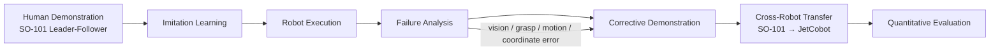
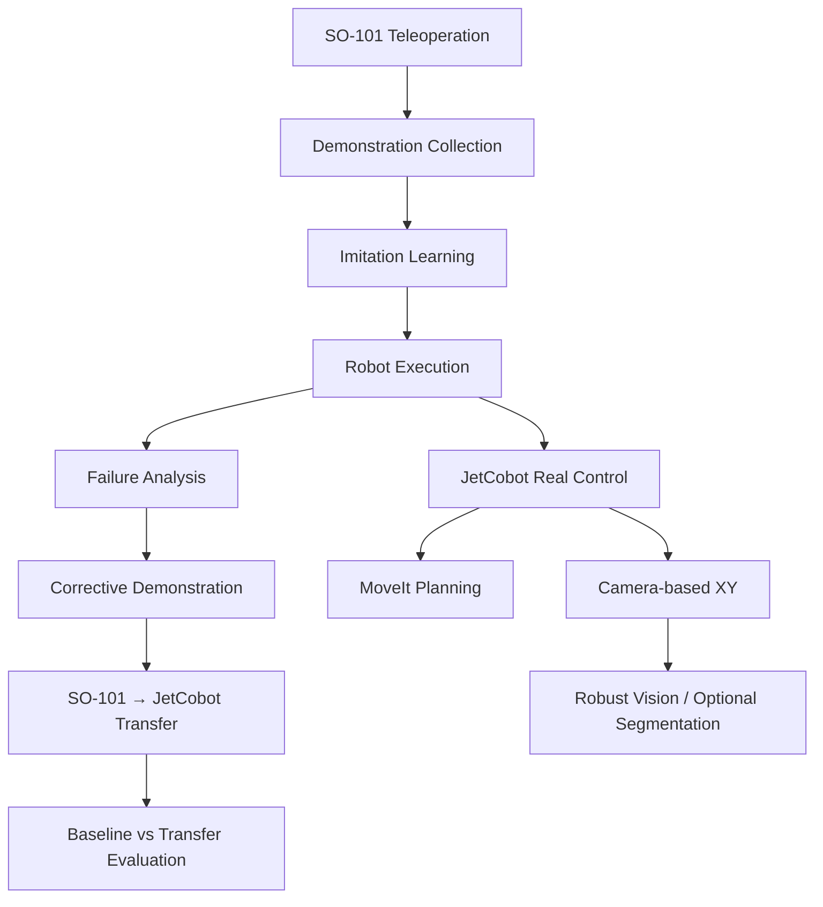

# Cross-Robot Corrective Demonstration Transfer
### SO-101 × JetCobot | Imitation Learning · Robot Manipulation · Vision · MoveIt

> **Research Question**  
> 한 로봇에서 얻은 **corrective demonstration(실패를 고치는 시연)** 을 다른 구조의 로봇에도 전이하면,  
> 새 로봇에서 필요한 **human correction 횟수**를 줄일 수 있을까?

이 저장소는 **SO-101과 JetCobot을 이용한 로봇 조작·모방학습 연구 포트폴리오**입니다.  
단순히 “로봇이 큐브를 집었다”는 데모를 보여주는 것이 아니라,

**실패 분석 → 사람의 부분 교정 → 다른 로봇으로 교정 정보 전이 → 필요한 추가 교정량 감소 여부를 정량 평가**

하는 연구를 목표로 합니다.

---

## 1. Research Overview



### Why this research?

로봇 모방학습은 사람이 여러 번 시연 데이터를 제공해야 하며, 실제 실행 중 새로운 상황을 만나면 추가 시연이나 교정이 필요합니다.

본 연구에서는 **한 로봇에서 이미 수집한 실패 교정 경험을 다른 로봇에서 재사용할 수 있는지**를 확인하려고 합니다. 성공한다면 서로 다른 로봇마다 같은 실패를 사람이 반복해서 다시 가르쳐야 하는 부담을 줄일 수 있습니다.

---

## 2. Research Questions

1. 서로 다른 로봇에서 발생하는 실패를 공통된 형태로 표현할 수 있는가?
2. SO-101에서 얻은 corrective demonstration 중 어떤 정보가 JetCobot에도 전이 가능한가?
3. 전이된 교정 데이터를 사용했을 때 JetCobot에서 필요한 **추가 human correction 횟수**가 감소하는가?
4. 서로 다른 관절 구조와 action representation 사이에서 어떤 변환이 필요한가?
5. 어떤 실패는 transfer되고, 어떤 실패는 robot-specific하여 transfer되지 않는가?

### Final Goal

**Cross-robot corrective learning이 실제로 사람의 추가 데이터 수집 부담을 줄이는지 정량적으로 검증하는 것**입니다.

---

## 3. Robot Platforms

| Platform | Main Role | Current Use |
|---|---|---|
| **SO-101 / LeRobot** | Human demonstration & imitation learning | Leader–Follower teleoperation, calibration, demonstration collection, policy execution |
| **JetCobot / Jetson / ROS 2** | Planning, vision, real-robot execution | pymycobot control, MoveIt, camera-based XY estimation, grasp execution |

---

## 4. What Has Been Implemented

### SO-101: Teleoperation & Imitation Learning

- Leader arm ↔ Follower arm teleoperation
- Leader/Follower calibration
- Pick-and-Place demonstration collection
- Imitation-learning dataset collection workflow
- Trained-policy execution experience
- 반복 실행 및 실패 상황 관찰

### JetCobot: Real-Robot Control

- Jetson 환경에서 실제 JetCobot 연결 및 제어
- `pymycobot` 기반 joint state 확인
- 실제 Pick-and-Place 동작 실행
- 반복 trial 사이의 상태가 섞이지 않도록 실행 로직 개선
- 관측 갱신 및 return sequence 안정화 실험

### ROS 2 + MoveIt: Motion Planning

- ROS 2 / MoveIt 기반 planning environment 구성
- Planning Scene에 cube/object 배치
- 목표 pose까지 motion planning
- 무작위 cube 배치 조건에서 경로 탐색 실험
- 충돌을 고려한 Pick-and-Place 흐름 검토
- 카메라 좌표를 MoveIt planning 입력으로 연결하기 위한 bridge 작업

### Vision: Camera → Robot XY

초기에는 HSV 색상 임계값을 이용했지만, 현재는 **색상 의존도를 낮추는 geometry 기반 방식**으로 발전시키고 있습니다.

```text
Camera Frame
    ↓
Camera Calibration / Undistortion
    ↓
Background Subtraction
    ↓
Rectangle Candidate Extraction
    ↓
Geometry + Physical-Size Scoring
    ↓
Target Pixel (u, v)
    ↓
Homography / Pixel → Robot XY
    ↓
Multi-Candidate Tracking
    ↓
Median-Based Stability Check
    ↓
Stable Robot Grasp Target
```

대표 구현: `cube_xy_geometry_web.py`

현재 확인한 기능:

- camera calibration YAML loading
- single-undistortion coordinate path
- background subtraction
- HSV 없이 dark / bright cube-like object detection
- multiple candidate detection
- 약 30 mm cube physical-size scoring
- incorrect physical rectangle rejection
- track association
- median stability
- movement reset
- stale-output guard
- detection-only safety interface

---

## 5. Current Research Status



### Completed / Tested

- SO-101 teleoperation and calibration
- demonstration collection workflow
- imitation-learning execution experience
- JetCobot real-arm communication and control
- repeated Pick-and-Place tuning
- MoveIt planning with scene objects
- camera calibration / background subtraction / geometry-based cube detection
- pixel-to-robot coordinate conversion
- multi-candidate stabilization logic

### In Progress

- 실제 환경에서 camera XY 정확도와 반복성 검증
- dark / bright cube 및 multi-candidate robustness 확인
- perception → MoveIt → real robot 연결 안정화
- 실패 유형 정리

### Planned / Not Yet Evaluated

- corrective demonstration transfer 자체의 정량 실험
- SO-101 correction → JetCobot action representation 변환
- Baseline vs Transfer 비교
- human correction 감소량 측정
- 최종 통계적 성능 분석

> **Important:** Cross-robot transfer의 최종 성능 결과는 아직 측정되지 않았습니다. 이 저장소는 현재 **진행 중인 연구 포트폴리오**이며, 결과가 없는 부분을 성공한 것처럼 표현하지 않습니다.

---

## 6. Experimental Design

최종 실험에서는 동일한 JetCobot task를 최소 두 조건으로 비교할 계획입니다.

### Baseline

```text
JetCobot initial policy
        ↓
Failure
        ↓
Human corrects JetCobot directly
        ↓
Fine-tuning / policy update
```

### Transfer

```text
SO-101 failure
        ↓
Corrective demonstration on SO-101
        ↓
Cross-robot representation / action conversion
        ↓
JetCobot receives transferred correction information
        ↓
Only remaining JetCobot-specific corrections are added
```

### Main Comparison

**Transfer 조건에서 JetCobot에 새로 제공해야 하는 사람 교정 횟수가 Baseline보다 감소하는가?**

---

## 7. Evaluation Metrics

| Metric | What it measures |
|---|---|
| **Task Success Rate** | Pick-and-Place 최종 성공률 |
| **Human Correction Count** | JetCobot에 새롭게 필요한 사람 교정 횟수 |
| **Correction Duration** | 사람이 직접 개입한 총 시간 |
| **Data Efficiency** | 추가 데이터량 대비 성능 개선량 |
| **Transferability** | 실패 유형별 교정 정보 전이 가능 여부 |
| **Robustness** | 위치·색·배경·초기 조건 변화에 대한 안정성 |

### Target Result Visualization

최종적으로 아래와 같은 비교 그래프를 추가할 예정입니다.

```text
Human Corrections Required

Baseline  ████████████
Transfer  ███████

→ 실제 측정값 확보 후 업데이트 예정
```

현재는 정량 실험 데이터가 없으므로 위 그래프는 **실험 목표를 설명하기 위한 구조 예시이며 실제 결과가 아닙니다.**

---

## 8. Representative Code

실제 프로젝트에서 사용한 대표 파일/워크플로우:

```text
cube_xy_geometry_web.py
└─ background subtraction
   geometry / physical-size scoring
   homography
   multi-track stabilization

camera_to_moveit_plan.py
└─ stable candidate selection
   camera target → MoveIt planning input bridge

act_golden_fast_return_3runs_v5.py
└─ repeated execution
   trial-state isolation
   fresh observation per trial
   return sequence

LeRobot workflow
└─ SO-101 calibration
   teleoperation
   dataset collection
   policy training / execution

ROS 2 + MoveIt workspace
└─ joint states
   planning scene
   cube placement
   motion planning
```

> README에 언급된 모든 실제 코드가 아직 GitHub에 업로드된 것은 아닙니다. 코드 공개 전에는 개인 IP, local path, device identifier, token, dataset 개인정보 등을 제거한 뒤 순차적으로 추가할 예정입니다.

---

## 9. Repository Structure

```text
holol/
├── README.md
├── index.html
├── src/
│   ├── so101/
│   ├── jetcobot/
│   ├── vision/
│   └── moveit/
├── configs/
├── launch/
├── results/
├── assets/
│   ├── images/
│   └── videos/
└── .nojekyll
```

현재 `src/`, `configs/`, `launch/`, `results/`, `assets/`에는 연구 자료를 정리해서 추가할 예정입니다.

---

## 10. Visual Evidence to Add

취업/연구 포트폴리오에서는 코드뿐 아니라 **실제로 동작하는 증거**를 함께 보여주는 것을 목표로 합니다.

우선순위:

1. SO-101 Leader → Follower teleoperation 영상
2. SO-101 imitation-learning Pick-and-Place 영상
3. JetCobot 실제 cube Pick-and-Place 영상
4. MoveIt / RViz random cube planning 화면
5. camera detection + robot XY 화면
6. failure → correction → improved execution 비교
7. 최종 Baseline vs Transfer quantitative result plot

---

## 11. Tech Stack

`Python` · `ROS 2` · `MoveIt` · `OpenCV` · `LeRobot` · `pymycobot` · `Jetson` · `Imitation Learning`

---

## 12. Research Roadmap

```text
[Done]
SO-101 teleoperation / calibration
        ↓
Imitation-learning workflow
        ↓
JetCobot real control
        ↓
MoveIt planning
        ↓
Camera → Robot XY

[Current]
Vision robustness
Perception → Planning integration
Failure taxonomy

[Next]
Corrective demonstration collection
        ↓
SO-101 → JetCobot transfer
        ↓
Baseline vs Transfer experiments
        ↓
Human correction reduction analysis
```

---

## Note

이 저장소의 목표는 완성된 결과만 전시하는 것이 아니라 **연구 질문이 실제 로봇 시스템과 실험으로 발전하는 전체 과정**을 기록하는 것입니다.

현재 단계에서는 **SO-101 학습 파이프라인, JetCobot 실제 제어, MoveIt 경로계획, geometry 기반 vision**까지 구축·시험했고, 핵심 연구 질문인 **cross-robot corrective demonstration transfer**의 정량 실험은 다음 단계입니다.
