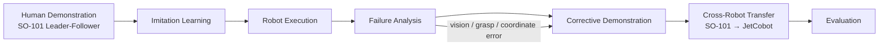
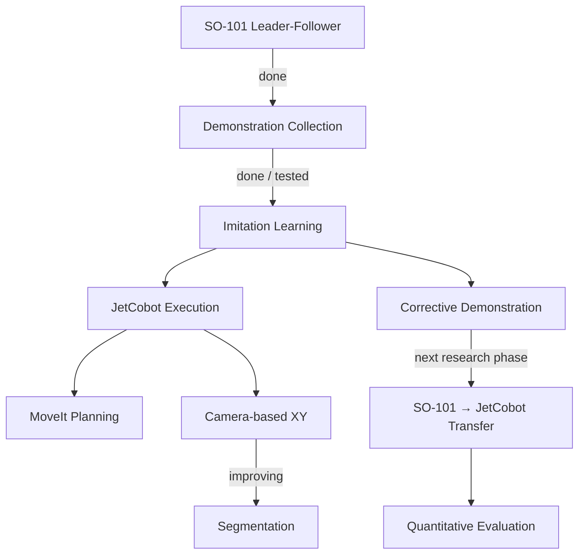

# Cross-Robot Corrective Demonstration Transfer
### SO-101 × JetCobot | Imitation Learning · Robot Manipulation · Vision · MoveIt

> **Working research question**  
> 한 로봇에서 수집한 corrective demonstration을 다른 구조의 로봇에서도 재사용하면,  
> 새 로봇에서 필요한 사람의 추가 교정 횟수를 줄일 수 있을까?

이 저장소는 **SO-101과 JetCobot을 이용한 로봇 조작 및 모방학습 연구의 진행 과정**을 정리합니다.  
단순 코드 모음이 아니라, 연구 질문 → 시스템 구축 → 실패 분석 → 교정 데이터 전이 실험으로 이어지는 흐름을 보여주는 것을 목표로 합니다.

---

## Research at a Glance



## Research Goal

최종 목표는 **한 로봇에서 이미 얻은 교정 경험을 다른 로봇이 재사용하여 사람의 반복적인 재시연 부담을 줄일 수 있는지 검증하는 것**입니다.

핵심 질문은 다음과 같습니다.

- 서로 다른 로봇에서 발생하는 실패를 공통된 형태로 표현할 수 있는가?
- SO-101에서 수집한 corrective demonstration 중 무엇이 JetCobot에도 전이 가능한가?
- 전이된 교정 데이터를 사용하면 JetCobot에서 필요한 human correction 수가 실제로 줄어드는가?
- 로봇의 구조와 제어 표현이 다를 때 어떤 변환이 필요한가?

---

## Platforms

| Platform | Main Role | Current Use |
|---|---|---|
| **SO-101 / LeRobot** | Human demonstration & imitation learning | Leader–Follower teleoperation, calibration, data collection, policy execution |
| **JetCobot / Jetson / ROS 2** | Motion planning, vision, real robot execution | pymycobot control, MoveIt, camera-based XY estimation, grasping |

---

## What I Have Built

### 1. SO-101 Teleoperation & Demonstration Collection
- Leader arm과 Follower arm을 이용한 텔레오퍼레이션
- 두 팔의 캘리브레이션
- Pick-and-Place 시연 수집
- 모방학습 데이터 수집 및 학습 정책 실행 경험

### 2. JetCobot Real-Robot Control
- Jetson 환경에서 JetCobot 제어
- `pymycobot` 기반 관절 상태 확인 및 동작 명령
- 반복 실행 시 trial 간 상태가 섞이지 않도록 실행 로직 조정
- Pick-and-Place 반복 동작 안정화 실험

### 3. MoveIt Simulation & Planning
- ROS 2 / MoveIt 기반 시뮬레이션
- Planning scene에 큐브 배치
- 목표 자세까지의 경로 계산
- 무작위 물체 배치 조건에서 경로계획 실험
- 충돌을 고려한 Pick-and-Place 흐름 검토

### 4. Camera-Based Object Position Estimation

비전 파이프라인은 초기 HSV 기반 방식에서 **색상에 덜 의존하는 geometry 기반 방식**으로 발전시키고 있습니다.

현재 최근 실험의 대표 파일은 `cube_xy_geometry_web.py`이며, 다음 흐름을 사용합니다.

```text
Camera frame
   ↓
Camera calibration / undistortion
   ↓
Background subtraction
   ↓
Rectangle candidate extraction
   ↓
Geometry + physical-size scoring
   ↓
Target center pixel (u, v)
   ↓
Homography / pixel → robot XY
   ↓
Multi-candidate tracking + median stability
   ↓
Stable robot grasp target
```

최근 self-test에서는 다음 항목을 확인했습니다.

- calibration YAML 로드 및 메타데이터 확인
- 좌표 변환 및 single-undistortion 경로 확인
- synthetic background subtraction
- HSV 없이 검정색 cube-like object 검출
- HSV 없이 밝은 cube-like object 검출
- multi-candidate detection
- 약 30 mm 큐브의 물리 크기 scoring
- 잘못된 물리 사각형 rejection
- multi-track association / median stability / movement reset / stale-output guard
- detection-only safety interface

### 5. Next Vision Step

먼저 geometry 기반 검출의 실제 환경 강건성을 충분히 검증하고, 복잡한 배경이나 다양한 물체로 확장할 필요가 있을 경우 segmentation을 결합하는 방향을 검토합니다.

---

## Representative Code

확인된 프로젝트 핵심 파일 예시:

```text
cube_xy_geometry_web.py
└─ background subtraction / geometry & physical-size scoring / homography / multi-track stabilization

act_golden_fast_return_3runs_v5.py
└─ repeated execution / trial-state isolation / new observation per run / return motion

LeRobot workflow
└─ SO-101 calibration / teleoperation / dataset collection / training / policy execution

ROS 2 + MoveIt workspace
└─ joint states / planning scene / cube placement / motion planning
```

> 공개 저장소에 업로드하기 전에는 개인 경로, IP, 장치 고유 정보, 불필요한 로그를 제거하는 것이 좋습니다.

---

## Current Research Status



### Completed / Tested
- SO-101 teleoperation and calibration
- Imitation-learning workflow experience
- JetCobot real-arm communication and control
- Repeated Pick-and-Place execution tuning
- MoveIt planning with scene objects
- background subtraction + geometry/physical-size scoring + coordinate conversion vision pipeline

### In Progress
- Camera detection robustness
- Object coordinate stability
- real-scene robustness for dark/bright cubes and multiple candidates

### Next
- Segmentation-based object recognition
- Failure taxonomy shared across two robots
- Corrective demonstration collection
- Cross-robot correction transfer
- Baseline vs transfer experiment

---

## Planned Evaluation

| Metric | Meaning |
|---|---|
| Task Success Rate | 실제 Pick-and-Place 성공률 |
| Human Correction Count | 새 로봇에 추가로 필요한 사람 교정 횟수 |
| Data Efficiency | 추가 데이터 양 대비 성능 향상 |
| Transferability | 실패 유형별 교정 정보 전이 가능 여부 |
| Robustness | 위치·색·배경 변화에 대한 안정성 |

---

## Media to Add

이 README와 `index.html`은 **실험 영상과 사진을 중심으로 보여주는 구조**로 설계했습니다.

추천 자료:

1. `SO-101 leader → follower teleoperation` 10–20초 영상
2. `JetCobot cube pick-and-place` 성공 영상
3. `MoveIt / RViz path planning` 화면
4. `camera detection + contour + XY` 화면
5. `failure → human correction → improved execution` 비교 영상
6. segmentation 적용 전/후 비교 이미지

파일은 아래처럼 정리하는 것을 권장합니다.

```text
assets/
├── images/
│   ├── so101_teleop.jpg
│   ├── moveit_planning.png
│   ├── vision_xy.png
│   └── transfer_overview.png
└── videos/
    ├── so101_demo.mp4
    ├── jetcobot_pick.mp4
    └── correction_comparison.mp4
```

---

## Research Page

이 저장소의 `index.html`은 GitHub Pages용 연구 소개 페이지입니다.

페이지 구성:
- Research Introduction
- Research Question
- SO-101 / JetCobot 역할
- Research Method
- Current Progress
- Representative Code
- Visual Evidence
- Next Experiments
- Evaluation Metrics

---

## Tech Stack

`Python` · `ROS 2` · `MoveIt` · `OpenCV` · `LeRobot` · `pymycobot` · `Jetson` · `Imitation Learning`

---

## Note

이 페이지는 현재 연구 진행 상태를 반영한 **working portfolio**입니다.  
최종 논문 수준의 성능 비교와 cross-robot corrective demonstration transfer는 향후 실험 단계입니다.
